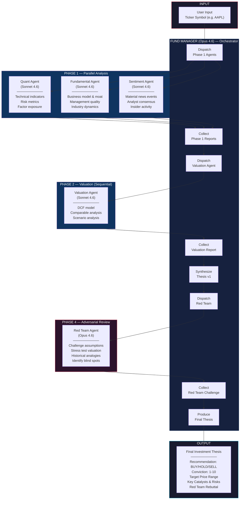
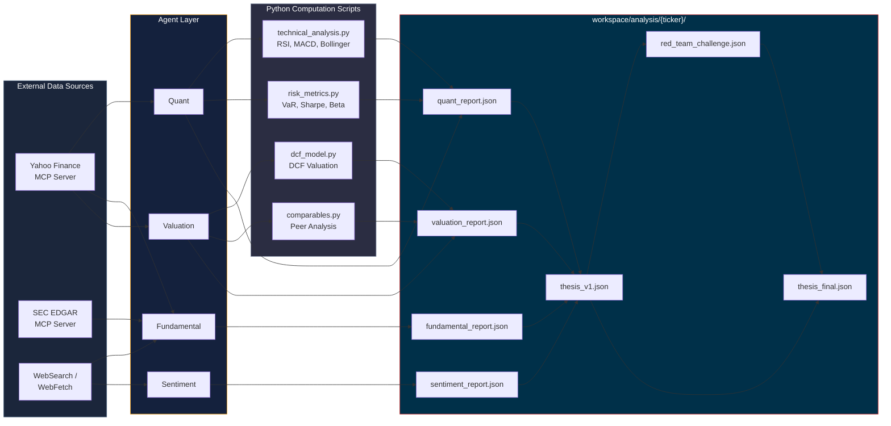
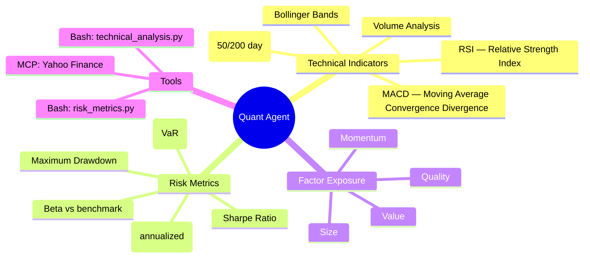
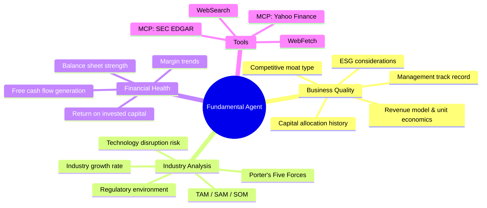
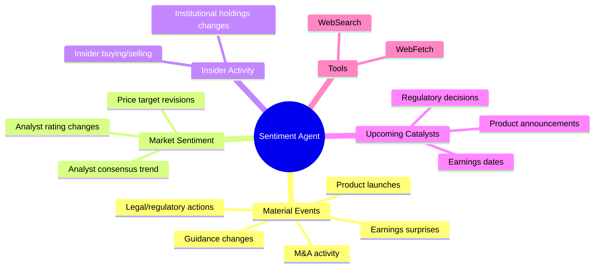
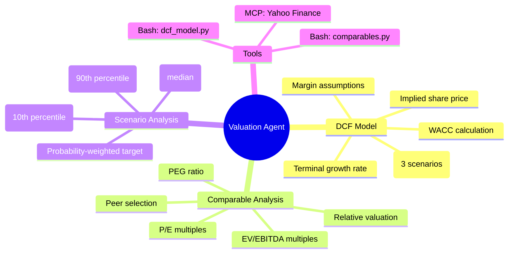
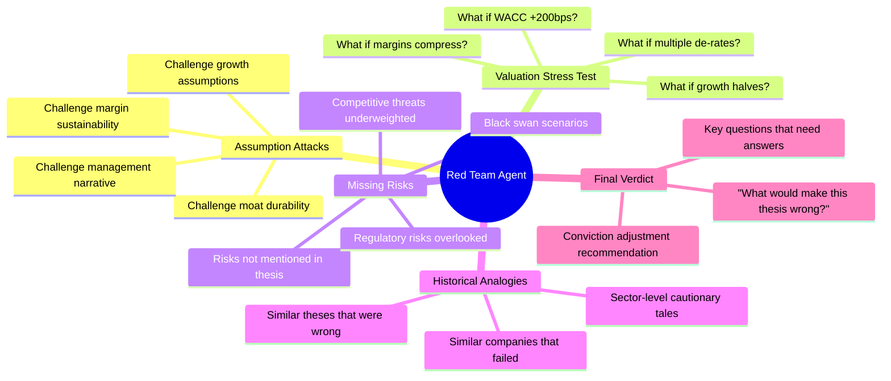
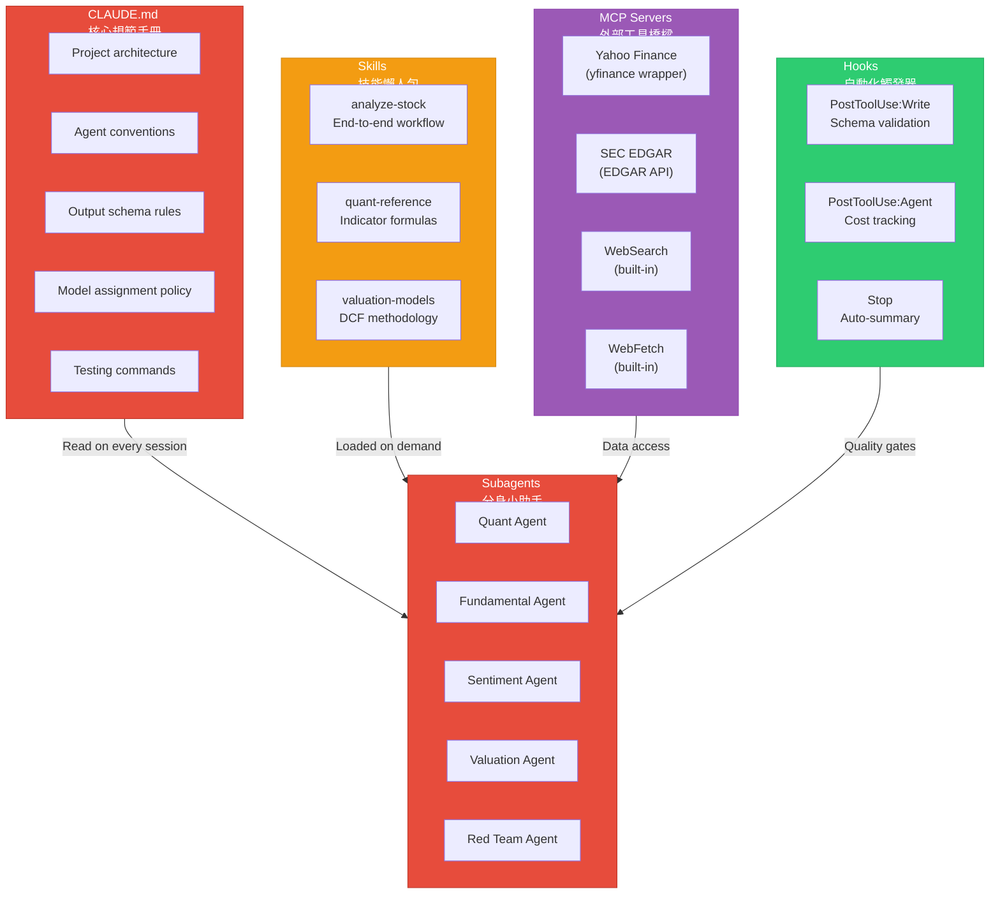

# AI Agent Finance Analyst — System Architecture

## Overview

A multi-agent investment analysis system powered by Claude. Six specialized agents collaborate in a fan-out/fan-in pattern with an adversarial review loop, replicating a professional buy-side research team.

**Tech Stack**: Python 3.11+ | Claude Agent SDK | MCP Servers | Pydantic

**Cost**: ~$1.30 per ticker analysis

---

## Agent Roster

| Agent | Model | Role | Input | Output |
|-------|-------|------|-------|--------|
| **Fund Manager** | Opus 4.6 | Orchestrator + synthesizer | All reports | Investment Thesis |
| **Quant** | Sonnet 4.6 | Technical & statistical analysis | Ticker | `quant_report.json` |
| **Fundamental** | Sonnet 4.6 | Business quality + industry analysis | Ticker | `fundamental_report.json` |
| **Sentiment** | Sonnet 4.6 | Material events & market sentiment | Ticker | `sentiment_report.json` |
| **Valuation** | Sonnet 4.6 | Intrinsic value estimation | Ticker + Phase 1 reports | `valuation_report.json` |
| **Red Team** | Opus 4.6 | Adversarial thesis challenge | Thesis v1 + all reports | `red_team_challenge.json` |

---

## System Flowchart



---

## Execution Timeline

```mermaid
gantt
    title Analysis Pipeline — Execution Phases
    dateFormat X
    axisFormat %s sec

    section Phase 1 (Parallel)
    Quant Agent           :a1, 0, 30
    Fundamental Agent     :a2, 0, 40
    Sentiment Agent       :a3, 0, 25

    section Phase 2 (Sequential)
    Valuation Agent       :a4, after a2, 35

    section Phase 3 (Synthesis)
    Fund Manager — Thesis v1 :a5, after a4, 20

    section Phase 4 (Adversarial)
    Red Team Agent        :a6, after a5, 40

    section Phase 5 (Final)
    Fund Manager — Final  :a7, after a6, 15
```



---

## Data Flow Diagram



---

## Agent Detail — Responsibilities & Tools

### Quant Agent


### Fundamental Agent


### Sentiment Agent


### Valuation Agent


### Red Team Agent


---

## Claude Code Ecosystem Mapping



---

## Project Structure

```
ai-agent-finance-analyst/
├── CLAUDE.md                           # Core rules for Claude Code sessions
├── pyproject.toml                      # Python project config & dependencies
├── .env.example                        # API key template
│
├── docs/
│   └── ARCHITECTURE.md                 # This file
│
├── src/
│   ├── main.py                         # CLI entry: python -m src.main analyze AAPL
│   ├── orchestrator.py                 # 5-phase fan-out/fan-in pipeline
│   │
│   ├── agents/
│   │   ├── definitions.py              # AgentDefinition objects (5 agents)
│   │   ├── prompts/
│   │   │   ├── quant.md                # Quant system prompt
│   │   │   ├── fundamental.md          # Fundamental system prompt
│   │   │   ├── sentiment.md            # Sentiment system prompt
│   │   │   ├── valuation.md            # Valuation system prompt
│   │   │   ├── fund_manager.md         # Fund Manager system prompt
│   │   │   └── red_team.md             # Red Team system prompt
│   │   └── schemas/
│   │       ├── quant.py                # Pydantic: quant output
│   │       ├── fundamental.py          # Pydantic: fundamental output
│   │       ├── sentiment.py            # Pydantic: sentiment output
│   │       ├── valuation.py            # Pydantic: valuation output
│   │       ├── thesis.py               # Pydantic: thesis output
│   │       └── red_team.py             # Pydantic: red team output
│   │
│   └── scripts/
│       ├── technical_analysis.py       # RSI, MACD, Bollinger, MA
│       ├── dcf_model.py                # DCF valuation engine
│       ├── comparables.py              # Comparable company analysis
│       └── risk_metrics.py             # VaR, Sharpe, Beta, drawdown
│
├── mcp_servers/
│   ├── yahoo_finance/
│   │   └── server.py                   # MCP server: yfinance wrapper
│   └── sec_edgar/
│       └── server.py                   # MCP server: SEC EDGAR API
│
├── .claude/
│   ├── settings.json                   # MCP config + hooks
│   └── skills/
│       ├── analyze-stock.md            # Skill: full analysis workflow
│       ├── quant-reference.md          # Skill: indicator formulas
│       └── valuation-models.md         # Skill: DCF methodology
│
├── workspace/                          # Runtime output (gitignored)
│   └── analysis/{ticker}/              # Per-ticker analysis reports
│
└── tests/
    ├── test_orchestrator.py
    ├── test_schemas.py
    └── test_scripts.py
```

---

## Output Schema — Final Thesis

```json
{
  "ticker": "AAPL",
  "date": "2026-04-05",
  "recommendation": "BUY",
  "conviction": 7,
  "target_price": {
    "bull": 245.00,
    "base": 218.00,
    "bear": 175.00
  },
  "current_price": 195.50,
  "time_horizon": "12 months",
  "key_catalysts": [
    "AI integration across product line driving ASP increases",
    "Services revenue growing 15%+ YoY with expanding margins"
  ],
  "key_risks": [
    "China regulatory and supply chain concentration",
    "Smartphone market saturation in developed markets"
  ],
  "red_team_summary": {
    "strongest_challenge": "Services growth assumes no antitrust intervention...",
    "thesis_adjustment": "Conviction reduced from 8 to 7 due to...",
    "unresolved_questions": [
      "What happens to margins if EU Digital Markets Act forces App Store changes?"
    ]
  },
  "agent_reports": {
    "quant": "workspace/analysis/AAPL/quant_report.json",
    "fundamental": "workspace/analysis/AAPL/fundamental_report.json",
    "sentiment": "workspace/analysis/AAPL/sentiment_report.json",
    "valuation": "workspace/analysis/AAPL/valuation_report.json",
    "red_team": "workspace/analysis/AAPL/red_team_challenge.json"
  }
}
```

---

## Quick Start (After Implementation)

```bash
# 1. Setup
git clone <repo> && cd ai-agent-finance-analyst
python -m venv .venv && source .venv/bin/activate
pip install -e ".[dev]"
cp .env.example .env   # Add your ANTHROPIC_API_KEY

# 2. Run analysis
python -m src.main analyze AAPL

# 3. View results
cat workspace/analysis/AAPL/thesis_final.json
```
